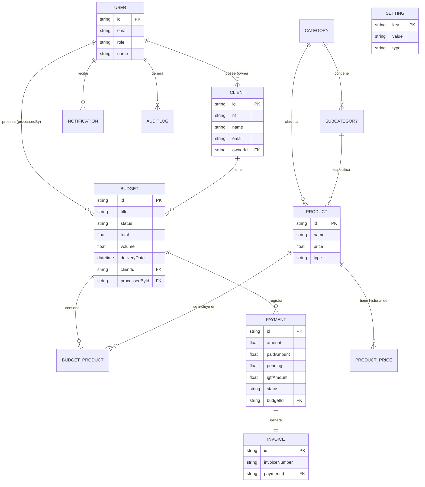

# Diagrama de Entidad Relación (MER) - Premezclados Manzanillo

Este documento contiene la representación visual de la arquitectura de la base de datos basada en el esquema de Prisma.

## Diagrama (Mermaid)



## Instrucciones para Visualizar el Diagrama

Para ver este diagrama de forma gráfica, tienes varias opciones:

### 1. Visual Studio Code (Recomendado)
Si estás usando VS Code, puedes instalar la extensión **"Markdown Preview Mermaid Support"** o **"Mermaid Editor"**. Una vez instalada, simplemente abre la vista previa de este archivo (`Ctrl + Shift + V`) y verás el gráfico generado automáticamente.

### 2. GitHub / GitLab
Si subes este archivo a tu repositorio en GitHub, el diagrama se renderizará automáticamente en la interfaz web de GitHub, ya que tiene soporte nativo para Mermaid en archivos Markdown.

### 3. Editor en Línea (Mermaid Live Editor)
Si quieres una visualización rápida sin instalar nada:
1. Copia el bloque de código que empieza con ```mermaid y termina con ```.
2. Ve a [Mermaid Live Editor](https://mermaid.live/).
3. Pega el código en el panel de la izquierda ("Code").
4. Podrás descargar el diagrama como una imagen (PNG), SVG o incluso un PDF.

---
*Archivo generado automáticamente por Antigravity para documentación técnica.*
